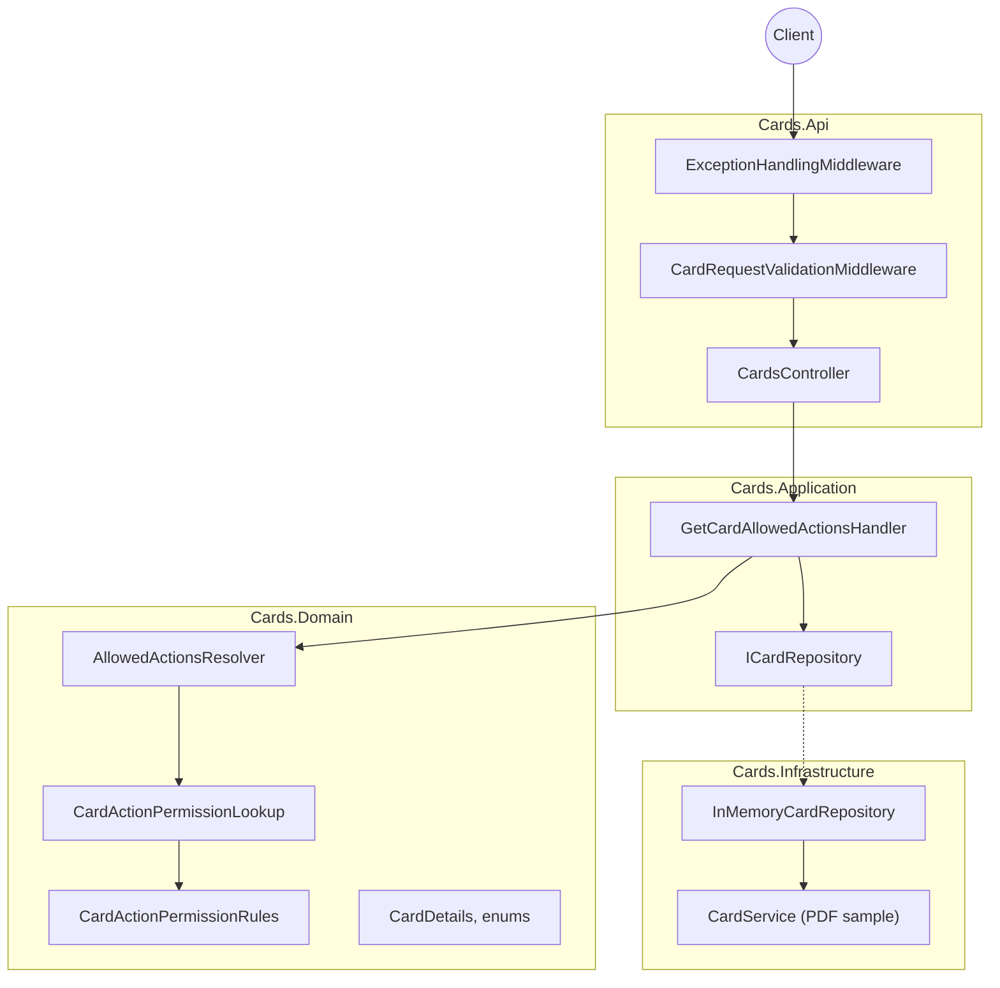
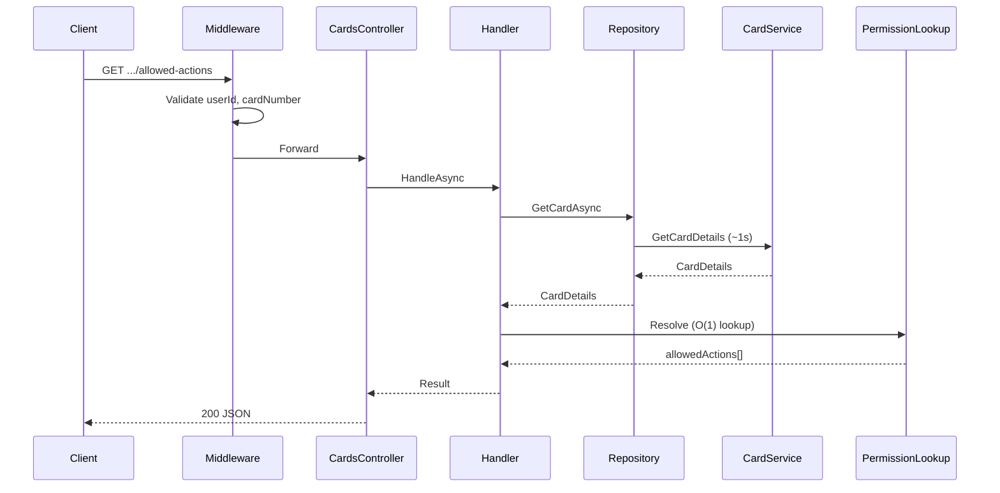

# Cards API

.NET 8 microservice that returns **allowed card operations** (`ACTION1`–`ACTION13`) for a user's card, based on card type, status, and whether a PIN is set.

Recruitment task implementation — see [docs/implementation-plan.md](docs/implementation-plan.md) for the full specification.

---

## Quick start

**Prerequisites:** [.NET 8 SDK](https://dotnet.microsoft.com/download/dotnet/8.0) (task requirement)

Install the **SDK** (not runtime-only). Verify:

```bash
dotnet --list-sdks       # must include 8.0.x
dotnet --list-runtimes   # must include Microsoft.AspNetCore.App 8.0.x
```

`global.json` prefers SDK 8.0.x but allows a newer SDK to build until 8 is installed. **API tests require `Microsoft.AspNetCore.App 8.0`** — `Microsoft.NETCore.App 8.0` alone is not enough.

```bash
chmod +x dev.sh

# Restore, build, test
./dev.sh all

# Build, test, and run API
./dev.sh dev

# Or step by step
./dev.sh run          # API on http://localhost:5202
./dev.sh docker       # API in Docker on http://localhost:8080
./dev.sh smoke        # live curl checks — API must already be running (see Tests)
```

<details>
<summary>Manual dotnet commands</summary>

```bash
dotnet restore Cards.sln
dotnet build Cards.sln
dotnet test Cards.sln
dotnet run --project src/Cards.Api
```

</details>

| What | URL |
|------|-----|
| API | http://localhost:5202 |
| Swagger UI | http://localhost:5202/swagger |
| Health | http://localhost:5202/health/ready |

**Try it** (see Swagger for more sample PANs):

```bash
curl http://localhost:5202/users/User1/cards/4010000000000174/allowed-actions
```

Sample users: `User1`, `User2`, `User3`. **cardNumber** must be a valid **PAN** (13–19 digits, Luhn check). Sample PANs are generated per user/card index — examples in Swagger (`/swagger`). Each lookup simulates ~1 s latency.

---

## API

```
GET /users/{userId}/cards/{cardNumber}/allowed-actions
```

**200 OK** — example:

```json
{
  "userId": "User1",
  "cardNumber": "4010000000000174",
  "cardType": "Prepaid",
  "cardStatus": "Closed",
  "isPinSet": false,
  "allowedActions": ["ACTION3", "ACTION4", "ACTION9"]
}
```

| Status | When |
|--------|------|
| `400` | Empty or whitespace `userId` / `cardNumber`, or invalid PAN |
| `404` | User or card not found in `CardService` |
| `500` | Unhandled error (Problem Details, no stack trace) |

---

## Architecture

Clean architecture with four layers. Dependencies point inward: **Api → Application → Domain**; **Infrastructure** implements application abstractions.



### Request flow



### Layer responsibilities

| Layer | Project | Role |
|-------|---------|------|
| **API** | `Cards.Api` | HTTP, Swagger, health checks, middleware, DTOs |
| **Application** | `Cards.Application` | Use case orchestration (`GetCardAllowedActionsHandler`) |
| **Domain** | `Cards.Domain` | Business rules, permission matrix, resolver |
| **Infrastructure** | `Cards.Infrastructure` | PDF `CardService`, in-memory repository |

### Key design choices

- **Permission matrix** — encoded in `CardActionPermissionRules` (13 operations × type/status/PIN rules from the PDF table).
- **Fast resolve** — `CardActionPermissionLookup` pre-computes all 42 `(type, status, PIN)` combinations at startup; runtime resolve is O(1).
- **Strategy seam** — `IAllowedActionsResolver` allows swapping rule engines without touching the handler.
- **Middleware** — validates route parameters and maps exceptions to [RFC 7807](https://tools.ietf.org/html/rfc7807) Problem Details.

Further patterns: [docs/design-patterns.md](docs/design-patterns.md).

---

## Solution structure

```
Cards.sln
src/
  Cards.Api/                 # Controllers, middleware, Swagger
  Cards.Application/         # Handler, repository abstraction
  Cards.Domain/              # Entities, rules, lookup, resolver
  Cards.Infrastructure/      # CardService, InMemoryCardRepository
tests/
  Cards.Domain.Tests/        # 42 CSV matrix tests + PAN tests
  Cards.Domain.Tests/matrix-test-cases.md
  Cards.Application.Tests/   # Handler unit tests
  Cards.Api.Tests/           # Integration + smoke tests
deploy/
  docker/                    # Dockerfile
  k8s/                       # Kubernetes manifests
  docker-compose.yml
  smoke-test.sh              # Post-deploy curl checks
docs/
  implementation-plan.md
  design-patterns.md
  allowed-actions-expected-results.md
```

---

## Tests

```bash
# All tests (62)
dotnet test Cards.sln

# Domain: 42 permission-matrix cases (catalog vs CSV)
dotnet test tests/Cards.Domain.Tests

# In-process smoke (fast, no running API)
dotnet test Cards.sln --filter "Category=Smoke"
# or
./dev.sh test-smoke
```

### Permission matrix (42 scenarios)

Each `(CardType × CardStatus × IsPinSet)` is tested in `CardAllowedActionsCatalogTests` against [docs/allowed-actions-permission-matrix.csv](docs/allowed-actions-permission-matrix.csv).

Full expected results: [tests/Cards.Domain.Tests/matrix-test-cases.md](tests/Cards.Domain.Tests/matrix-test-cases.md)

### Live smoke (curl, API must be running)

Start the API first (`./dev.sh run` or `./dev.sh docker`), then:

```bash
# Local API (default BASE_URL=http://localhost:5202)
./dev.sh smoke

# Docker / Kubernetes (port 8080)
BASE_URL=http://localhost:8080 ./dev.sh smoke

# Or call the script directly
chmod +x deploy/smoke-test.sh
./deploy/smoke-test.sh
BASE_URL=http://localhost:8080 ./deploy/smoke-test.sh
```

Integration tests use `FakeCardRepository` (no 1 s delay). Live smoke hits a real running instance via `deploy/smoke-test.sh`.

---

## Docker

```bash
docker compose -f deploy/docker-compose.yml up --build
```

- API: http://localhost:8080
- Swagger: http://localhost:8080/swagger

Image targets **.NET 8** (`mcr.microsoft.com/dotnet/aspnet:8.0`).

---

## Kubernetes

```bash
docker build -f deploy/docker/Dockerfile -t cards-api:latest .
kubectl apply -f deploy/k8s/
kubectl port-forward -n cards svc/cards-api 8080:80
```

Then open http://localhost:8080/swagger or run `./deploy/smoke-test.sh` with `BASE_URL=http://localhost:8080`.

---

## Documentation

| Document | Contents |
|----------|----------|
| [implementation-plan.md](docs/implementation-plan.md) | Requirements, API contract, acceptance criteria |
| [design-patterns.md](docs/design-patterns.md) | GoF patterns used in the codebase |
| [allowed-actions-expected-results.md](docs/allowed-actions-expected-results.md) | How matrix tests verify the catalog against the CSV |
| [matrix-test-cases.md](tests/Cards.Domain.Tests/matrix-test-cases.md) | All 42 expected action lists |

---

## Tech stack

| Item | Choice |
|------|--------|
| Runtime | **.NET 8** (per task requirements) |
| Web | ASP.NET Core, Swashbuckle (Swagger) |
| Tests | xUnit, FluentAssertions, NSubstitute |
| Deploy | Docker, Kubernetes, docker-compose |
