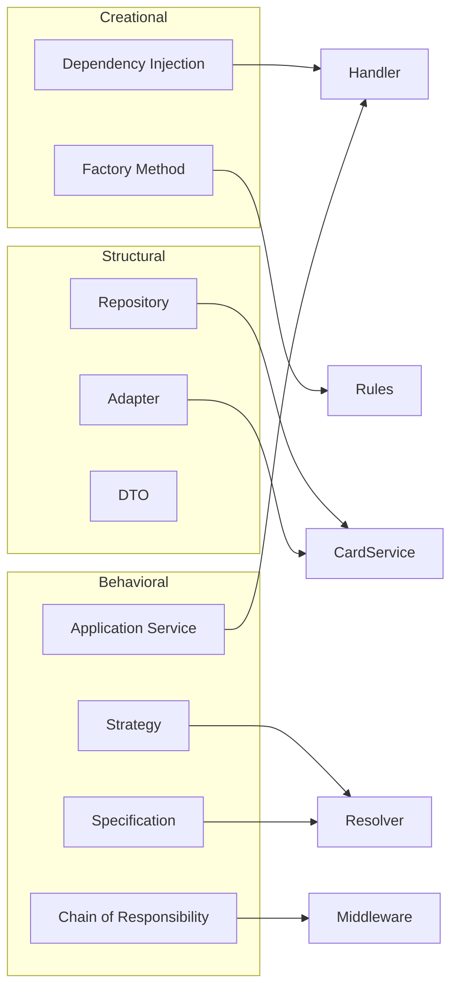

# Design Patterns

Patterns used in the Card Allowed Actions microservice, grouped by the **Gang of Four** categories and mapped to concrete code.

**Related:** [implementation-plan.md](./implementation-plan.md) §7

---

## Overview



---

## Creational patterns

Patterns that deal with object creation and composition.

| Pattern | Where | Purpose |
|---------|--------|---------|
| **Dependency Injection** (IoC) | `Program.cs`, `DependencyInjection.cs` in Application & Infrastructure | Compose the object graph at startup; controllers and handlers receive dependencies via constructor injection instead of `new` |
| **Singleton** | `Infrastructure/DependencyInjection.cs` — `AddSingleton<ICardRepository>`, `AddSingleton<IAllowedActionsResolver>` | One shared instance of repository and resolver for the app lifetime (stateless services) |
| **Factory Method** | `CardActionPermissionRules` — private `Rule()`, `AllStatuses()`, `ActiveOnly()`, etc. | Encapsulate construction of each `CardActionPermissionRule` row; callers use `CardActionPermissionRules.All` without knowing build details |

### Code references

**Dependency Injection — composition root:**

```csharp
// Program.cs
builder.Services.AddApplication();
builder.Services.AddInfrastructure();
```

```csharp
// Infrastructure/DependencyInjection.cs
services.AddSingleton<ICardRepository, InMemoryCardRepository>();
services.AddSingleton<IAllowedActionsResolver, AllowedActionsResolver>();
```

**Factory Method — rule row construction:**

```csharp
// Domain/Rules/CardActionPermissionRules.cs
private static CardActionPermissionRule Rule(
    string operation,
    CardType[] types,
    Dictionary<CardStatus, StatusEligibility> statuses) =>
    new(operation, new HashSet<CardType>(types), statuses);
```

### Not used (and why)

| Pattern | Reason |
|---------|--------|
| Abstract Factory | Single rule family; static `CardActionPermissionRules` is sufficient |
| Builder | Rule objects are small records, not complex graphs |
| Prototype | No need to clone rule objects at runtime |

---

## Structural patterns

Patterns that compose classes and objects into larger structures.

| Pattern | Where | Purpose |
|---------|--------|---------|
| **Repository** | `ICardRepository` / `InMemoryCardRepository` | Hide persistence details; application layer depends on an abstraction, not `CardService` |
| **Adapter** | `InMemoryCardRepository` wraps `CardService` | Adapt the PDF sample `CardService` API to the application's `ICardRepository` contract |
| **DTO** (Data Transfer Object) | `AllowedActionsResponse` (API) vs `GetCardAllowedActionsResult` (Application) | Decouple HTTP contract from use-case model; API layer maps between them |
| **Layered architecture** | `Api` → `Application` → `Domain` ← `Infrastructure` | Physical separation of concerns; dependencies point inward toward Domain |

### Code references

**Repository + Adapter:**

```csharp
// Infrastructure/Persistence/InMemoryCardRepository.cs
public sealed class InMemoryCardRepository : ICardRepository
{
    private readonly CardService _cardService = new();

    public Task<CardDetails?> GetCardAsync(...) =>
        _cardService.GetCardDetails(userId, cardNumber);
}
```

**DTO mapping:**

```csharp
// Api/Controllers/CardsController.cs
var result = await _handler.HandleAsync(userId, cardNumber, cancellationToken);
return Ok(new AllowedActionsResponse(
    result.UserId, result.CardNumber,
    result.CardType.ToString(), result.CardStatus.ToString(),
    result.IsPinSet, result.AllowedActions));
```

### Not used (and why)

| Pattern | Reason |
|---------|--------|
| Decorator | No cross-cutting wrappers around repository/resolver needed beyond middleware |
| Proxy | No lazy loading or remote proxy; direct in-memory access |
| Facade | Handler is thin; full Facade would duplicate Application Service role |
| Composite | Permission rules are a flat list, not a tree |

---

## Behavioral patterns

Patterns that govern communication and responsibility assignment.

| Pattern | Where | Purpose |
|---------|--------|---------|
| **Strategy** | `IAllowedActionsResolver` / `AllowedActionsResolver` | Encapsulate the algorithm for computing allowed actions; swappable implementation (e.g. config-driven rules later) without changing the handler |
| **Specification** | `StatusEligibility` + `IsPermitted()` in resolver | Each matrix cell is a spec (`Always`, `Never`, `PinRequired`, `PinNotSet`); rules are combined per operation |
| **Chain of Responsibility** | `ExceptionHandlingMiddleware` + ASP.NET pipeline | Exceptions propagate to middleware; `CardNotFoundException` → 404, others → 500 |
| **Application Service** (DDD) | `GetCardAllowedActionsHandler` | Single use case: fetch card → resolve actions → return result; keeps controller thin |

### Code references

**Strategy:**

```csharp
// Domain/Services/IAllowedActionsResolver.cs
public interface IAllowedActionsResolver
{
    IReadOnlyList<string> Resolve(CardDetails card);
}
```

**Specification:**

```csharp
// Domain/Services/AllowedActionsResolver.cs
private static bool IsPermitted(StatusEligibility eligibility, bool isPinSet) =>
    eligibility switch
    {
        StatusEligibility.Always      => true,
        StatusEligibility.Never       => false,
        StatusEligibility.PinRequired => isPinSet,
        StatusEligibility.PinNotSet   => !isPinSet,
        _ => false
    };
```

**Chain of Responsibility (validation):**

```csharp
// Api/Middleware/CardRequestValidationMiddleware.cs
// Matches /users/{userId}/cards/{cardNumber}/allowed-actions
// Returns 400 ProblemDetails when userId or cardNumber is empty/whitespace
```

**Chain of Responsibility (errors):**

```csharp
// Api/Middleware/ExceptionHandlingMiddleware.cs
catch (CardNotFoundException ex) → 404 ProblemDetails
catch (Exception ex)              → 500 ProblemDetails
```

**Application Service:**

```csharp
// Application/Services/GetCardAllowedActionsHandler.cs
public async Task<GetCardAllowedActionsResult> HandleAsync(...)
{
    var card = await _cardRepository.GetCardAsync(...);
    if (card is null) throw new CardNotFoundException(...);
    var allowedActions = _resolver.Resolve(card);
    return new GetCardAllowedActionsResult(...);
}
```

### Not used (and why)

| Pattern | Reason |
|---------|--------|
| Command / MediatR | One endpoint; dedicated handler is simpler |
| Observer | No event subscribers |
| State | Card status is data, not behavior delegated to State objects |
| Template Method | No shared algorithm skeleton with varying steps |
| Iterator | `foreach` over `CardActionPermissionRules.All` is sufficient |

---

## Pattern → file index

| Pattern | Category | File(s) |
|---------|----------|---------|
| Dependency Injection | Creational | `Api/Program.cs`, `*/DependencyInjection.cs` |
| Singleton | Creational | `Infrastructure/DependencyInjection.cs` |
| Factory Method | Creational | `Domain/Rules/CardActionPermissionRules.cs` |
| Repository | Structural | `Application/Abstractions/ICardRepository.cs`, `Infrastructure/Persistence/InMemoryCardRepository.cs` |
| Adapter | Structural | `Infrastructure/Persistence/InMemoryCardRepository.cs` |
| DTO | Structural | `Api/Models/AllowedActionsResponse.cs`, `Application/Models/GetCardAllowedActionsResult.cs` |
| Strategy | Behavioral | `Domain/Services/IAllowedActionsResolver.cs`, `Domain/Services/AllowedActionsResolver.cs` |
| Specification | Behavioral | `Domain/Rules/StatusEligibility.cs`, `Domain/Services/AllowedActionsResolver.cs` |
| Chain of Responsibility | Behavioral | `ExceptionHandlingMiddleware.cs`, `CardRequestValidationMiddleware.cs` |
| Application Service | Behavioral | `Application/Services/GetCardAllowedActionsHandler.cs` |

---

## Testing and patterns

| Pattern | How tests use it |
|---------|------------------|
| **Strategy** | Handler tests inject `NSubstitute` mock of `IAllowedActionsResolver` |
| **Repository** | Handler tests mock `ICardRepository` to isolate use-case logic |
| **Specification** | 42 `[Theory]` cases verify rule specs via full resolver output |

---

## Extension points (patterns enable future change)

| Change | Pattern that supports it |
|--------|--------------------------|
| Replace in-memory cards with HTTP client | Repository + Adapter — new `HttpCardRepository` |
| Load rules from database or config | Strategy — new `ConfigurableAllowedActionsResolver` |
| Add caching around card lookup | Decorator — `CachingCardRepository : ICardRepository` |
| Add more use cases | Application Service — new handlers alongside existing one |
