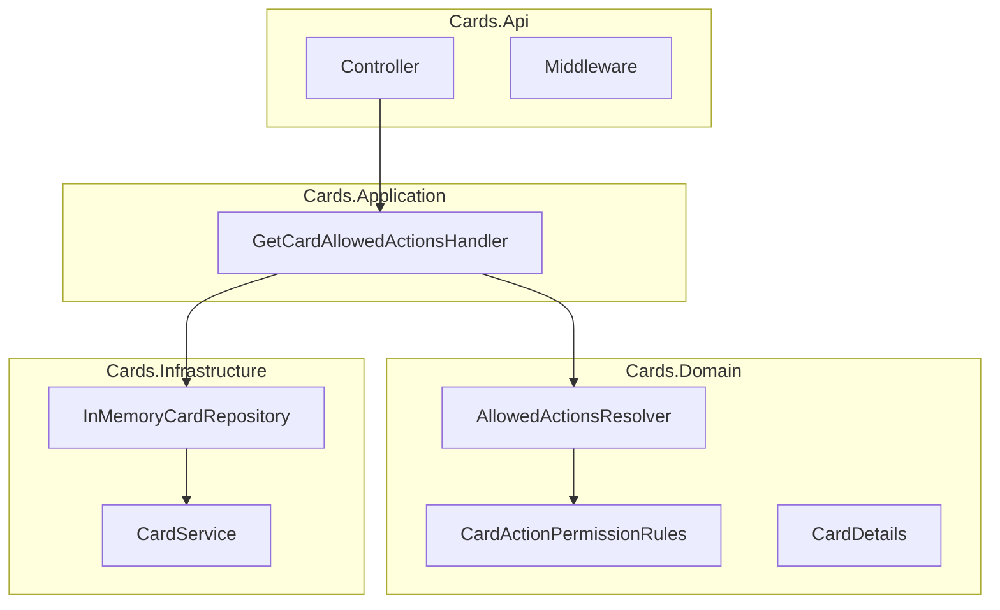
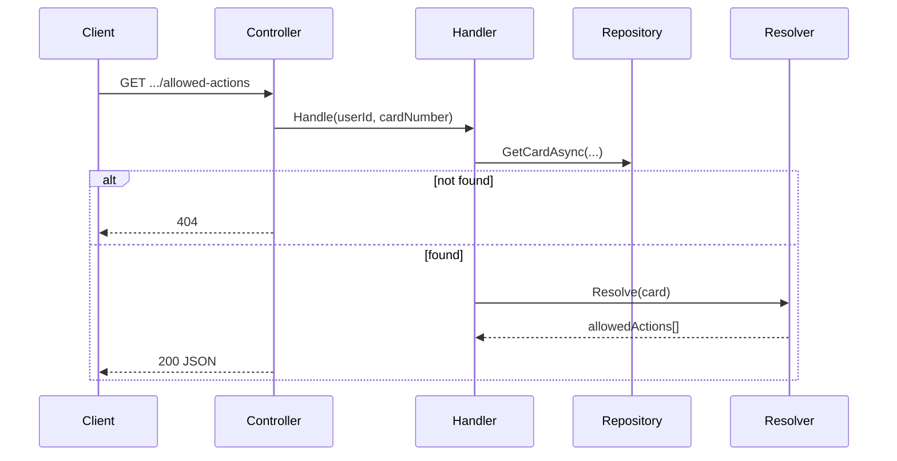

# Card Allowed Actions — Specification & Implementation Plan

> **Status:** Implemented  
> **Stack:** C# / .NET 8 / ASP.NET Core  
> **Source task:** [Zadanie programistyczne2_2025.pdf](./Zadanie%20programistyczne2_2025.pdf)

---

## Document map

| Document | Role |
|----------|------|
| **This file** | Requirements, architecture, API contract, implementation order |
| [design-patterns.md](./design-patterns.md) | Creational, structural, and behavioral patterns mapped to code |
| [allowed-actions-permission-matrix.csv](./allowed-actions-permission-matrix.csv) | Human-readable permission rules (from PDF table) |
| [allowed-actions-expected-results.md](./allowed-actions-expected-results.md) | 42 test scenarios — expected resolver output |
| [Zadanie programistyczne2_2025.pdf](./Zadanie%20programistyczne2_2025.pdf) | Original task description and sample `CardService` |

---

## 1. Problem statement

Build a **microservice** that, given a **user ID** and **card number**, returns the list of **allowed card operations** (`ACTION1` … `ACTION13`) based on:

- card **type** (Prepaid, Debit, Credit),
- card **status** (Ordered … Closed),
- whether a **PIN is set**.

Card metadata comes from the sample `CardService` provided in the PDF (in-memory data, simulated 1 s latency). Permission rules come from the matrix in the PDF / CSV.

---

## 2. Requirements

### 2.1 Functional (from PDF)

| ID | Requirement |
|----|-------------|
| F-1 | Expose an HTTP API accepting `userId` and `cardNumber` |
| F-2 | Load card details via `CardService.GetCardDetails` |
| F-3 | Return allowed actions as JSON |
| F-4 | Apply permission rules from the matrix (type + status + PIN) |
| F-5 | Use provided enums, `CardDetails` record, and `CardService` sample |

### 2.2 Non-functional

| ID | Requirement |
|----|-------------|
| NF-1 | .NET 8 |
| NF-2 | Reliable handling of edge cases and errors |
| NF-3 | Clean, readable, extensible code |
| NF-4 | Committed to GitHub |
| NF-5 | Swagger in Development |
| NF-6 | Docker image + Kubernetes manifests |
| NF-7 | Health endpoints for container orchestration |

### 2.3 Out of scope (v1)

- Real external card service / database
- Authentication & authorization
- Loading rules from CSV at runtime
- ACTION14+ or custom operations

---

## 3. Acceptance criteria

Implementation is complete when all of the following pass:

- [ ] `GET /users/{userId}/cards/{cardNumber}/allowed-actions` returns correct JSON for PDF examples (unit/integration level)
- [ ] All **42** resolver scenarios in [allowed-actions-expected-results.md](./allowed-actions-expected-results.md) pass
- [ ] Unknown user or card → **404** (not 200 with empty list)
- [ ] Invalid `userId` / `cardNumber` → **400**
- [ ] `dotnet test` green
- [ ] `docker compose up --build` serves API on port 8080
- [ ] `kubectl apply -f deploy/k8s/` deploys successfully (local cluster)
- [ ] Swagger available at `/swagger` in Development
- [ ] README documents how to run locally, via Docker, and how to call the API

---

## 4. Domain model

Types from the PDF — keep names and shapes compatible:

```csharp
public enum CardType  { Prepaid, Debit, Credit }

public enum CardStatus
{
    Ordered, Inactive, Active, Restricted, Blocked, Expired, Closed
}

public record CardDetails(
    string CardNumber,
    CardType CardType,
    CardStatus CardStatus,
    bool IsPinSet);
```

### 4.1 Sample data (`CardService`)

Provided behaviour (do not change semantics):

| Property | Value |
|----------|-------|
| Users | `User1`, `User2`, `User3` |
| Cards per user | 21 (= 3 types × 7 statuses) |
| Card number format | `Card{userIndex}{cardIndex}` — e.g. `Card17` = User1, card index 7 |
| Card index order | Nested loops: `foreach CardType` → `foreach CardStatus`, index 1…21 |
| PIN flag | `IsPinSet = (cardIndex % 2 == 0)` |
| Latency | `await Task.Delay(1000)` on every lookup |

**Card index reference (same for every user):**

| cardIndex | CardType | CardStatus |
|-----------|----------|------------|
| 1–7 | Prepaid | Ordered → Closed |
| 8–14 | Debit | Ordered → Closed |
| 15–21 | Credit | Ordered → Closed |

**Examples (User1):**

| cardNumber | Type | Status | IsPinSet |
|------------|------|--------|----------|
| `Card11` | Prepaid | Ordered | false |
| `Card17` | Prepaid | Closed | false |
| `Card119` | Credit | Blocked | false |
| `Card120` | Credit | Expired | true |

> **Note:** PDF example *Credit + Blocked + PIN set* cannot be hit via sample data alone (`Card119` has `IsPinSet = false`). Verify that case in **unit tests** with a constructed `CardDetails`; use sample data for integration smoke tests.

---

## 5. Permission rules

### 5.1 Evaluation algorithm

For each operation `ACTION1` … `ACTION13`:

```
allowed =
  matrix[operation].typeAllows(card.CardType)
  AND matrix[operation].statusAllows(card.CardStatus, card.IsPinSet)
```

Return all allowed operations in ascending order (`ACTION1` … `ACTION13`).

### 5.2 Matrix cell semantics

| CSV value | Code enum | Result |
|-----------|-----------|--------|
| `TAK` | `Always` | allowed |
| `NIE` | `Never` | denied |
| `TAK - ale jak nie ma pin to NIE` | `PinRequired` | allowed if `IsPinSet` |
| `TAK - jeżeli brak pin` | `PinNotSet` | allowed if `!IsPinSet` |
| `TAK - jeżeli pin nadany` | `PinRequired` | allowed if `IsPinSet` |

An operation requires **both** type column `TAK` **and** a permissive status cell.

### 5.3 PDF regression cases

| CardType | CardStatus | IsPinSet | Expected actions |
|----------|------------|----------|------------------|
| Prepaid | Closed | any | ACTION3, ACTION4, ACTION9 |
| Credit | Blocked | true | ACTION3, ACTION4, ACTION5, ACTION6, ACTION7, ACTION8, ACTION9 |
| Credit | Blocked | false | ACTION3, ACTION4, ACTION5, ACTION8, ACTION9 |

Full matrix: [allowed-actions-permission-matrix.csv](./allowed-actions-permission-matrix.csv)  
All scenarios: [allowed-actions-expected-results.md](./allowed-actions-expected-results.md)

### 5.4 Rules in code (not CSV at runtime)

Transcribe the matrix into `CardActionPermissionRules.cs` in the Domain layer:

```csharp
public enum StatusEligibility { Always, Never, PinRequired, PinNotSet }

public sealed record CardActionPermissionRule(
    string Operation,                                    // "ACTION1" … "ACTION13"
    IReadOnlySet<CardType> AllowedTypes,
    IReadOnlyDictionary<CardStatus, StatusEligibility> StatusRules);
```

`allowed-actions-permission-matrix.csv` stays in `docs/` as documentation only.

---

## 6. API specification

### 6.1 Endpoint

```
GET /users/{userId}/cards/{cardNumber}/allowed-actions
```

| Parameter | In | Type | Validation |
|-----------|-----|------|------------|
| `userId` | path | string | required, non-empty, not whitespace |
| `cardNumber` | path | string | required, non-empty, not whitespace |

### 6.2 Success — `200 OK`

```json
{
  "userId": "User1",
  "cardNumber": "Card17",
  "cardType": "Prepaid",
  "cardStatus": "Closed",
  "isPinSet": false,
  "allowedActions": ["ACTION3", "ACTION4", "ACTION9"]
}
```

| Field | Type | Notes |
|-------|------|-------|
| `userId` | string | echoed from request |
| `cardNumber` | string | echoed from request |
| `cardType` | string | enum name |
| `cardStatus` | string | enum name |
| `isPinSet` | boolean | from card details |
| `allowedActions` | string[] | ordered ACTION1…ACTION13 subset |

JSON uses **camelCase**. Enum values serialized as strings (e.g. `"Prepaid"`, not `0`).

### 6.3 Errors — RFC 7807 Problem Details

**400 Bad Request** — invalid path parameters:

```json
{
  "title": "Bad Request",
  "status": 400,
  "detail": "userId must not be empty."
}
```

**404 Not Found** — user or card does not exist in `CardService`:

```json
{
  "title": "Not Found",
  "status": 404,
  "detail": "Card 'Card99' not found for user 'User1'."
}
```

**500 Internal Server Error** — unhandled exception (no stack trace in response body).

### 6.4 Health endpoints

| Path | Purpose |
|------|---------|
| `GET /health` | Overall health |
| `GET /health/live` | Liveness probe |
| `GET /health/ready` | Readiness probe |

### 6.5 Swagger

- Package: `Swashbuckle.AspNetCore`
- UI at `/swagger` when `ASPNETCORE_ENVIRONMENT=Development`
- Controller annotated with `[ProducesResponseType]` for 200 / 400 / 404

---

## 7. Architecture

### 7.1 Layers



### 7.2 Responsibilities

| Component | Responsibility |
|-----------|----------------|
| `CardsController` | HTTP, map to/from DTOs (validation in middleware) |
| `GetCardAllowedActionsHandler` | Orchestrate: fetch card → resolve actions |
| `ICardRepository` | Abstract `CardService` (future: HTTP client) |
| `IAllowedActionsResolver` | Apply permission rules to `CardDetails` |
| `CardActionPermissionRules` | Static rule definitions (from matrix) |
| `InMemoryCardRepository` | Wrap PDF `CardService` |

### 7.3 Request flow



### 7.4 Project structure

```
src/
  Cards.Api/
  Cards.Application/
  Cards.Domain/
  Cards.Infrastructure/
tests/
  Cards.Domain.Tests/
  Cards.Application.Tests/
  Cards.Api.Tests/
deploy/
  docker/Dockerfile, .dockerignore
  k8s/namespace.yaml, deployment.yaml, service.yaml, ingress.yaml
  docker-compose.yml
```

**References:** `Api → Application → Domain`, `Infrastructure → Application + Domain`.

### 7.5 Design patterns

Full reference: **[design-patterns.md](./design-patterns.md)** — creational, structural, and behavioral patterns with code links.

#### Creational

| Pattern | Where | Purpose |
|---------|--------|---------|
| **Dependency Injection** | `Program.cs`, `DependencyInjection.cs` | Compose object graph at startup |
| **Singleton** | `AddSingleton<ICardRepository>`, `AddSingleton<IAllowedActionsResolver>` | Shared stateless services |
| **Factory Method** | `CardActionPermissionRules.Rule()`, `AllStatuses()`, … | Build each permission rule row |

#### Structural

| Pattern | Where | Purpose |
|---------|--------|---------|
| **Repository** | `ICardRepository` / `InMemoryCardRepository` | Hide card data access |
| **Adapter** | `InMemoryCardRepository` → `CardService` | Fit PDF sample API to repository contract |
| **DTO** | `AllowedActionsResponse` vs `GetCardAllowedActionsResult` | Separate HTTP contract from use-case model |
| **Layered architecture** | `Api` → `Application` → `Domain` | Inward dependencies, clear boundaries |

#### Behavioral

| Pattern | Where | Purpose |
|---------|--------|---------|
| **Strategy** | `IAllowedActionsResolver` | Swappable rules engine |
| **Specification** | `StatusEligibility` + `IsPermitted()` | Pin/status rules per matrix cell |
| **Chain of Responsibility** | `ExceptionHandlingMiddleware`, `CardRequestValidationMiddleware` | Errors → Problem Details; route validation before controller |
| **Application Service** | `GetCardAllowedActionsHandler` | Orchestrate one use case |

#### Architectural (cross-cutting)

| Pattern | Purpose |
|---------|---------|
| **Clean Architecture** | Domain has no infrastructure dependencies |
| **Problem Details (RFC 7807)** | Uniform 400 / 404 / 500 error bodies |

---

## 8. Testing

### 8.1 Resolver — 42 theory cases

One `[Theory]` per `(CardType, CardStatus, IsPinSet)` asserting the **full** action list.

```
3 kinds × 7 statuses × 2 PIN states = 42 tests
```

Data source: `CardAllowedActionsCatalog` (from `CardActionPermissionRules`).

```csharp
[Theory]
[ClassData(typeof(CardPermissionScenariosTestData))]
public void Resolve_returns_expected_actions(
    CardType type, CardStatus status, bool isPinSet, string[] expected)
{
    var card = new CardDetails("test", type, status, isPinSet);
    _sut.Resolve(card).Should().BeEquivalentTo(expected, o => o.WithStrictOrdering());
}
```

Prepaid ≡ Debit in the matrix — optionally reduce to **28** tests (skip duplicate Debit rows).

### 8.2 Other layers

| Layer | Cases | What |
|-------|-------|------|
| Application | ~3 | Handler: card found / not found |
| API | ~5 | 200 with `Card17`, 404 unknown card, 400 empty params |

### 8.3 Sample-data integration examples

| Request | Expected |
|---------|----------|
| `GET .../User1/cards/Card17/allowed-actions` | 200 — Prepaid Closed → ACTION3, ACTION4, ACTION9 |
| `GET .../User1/cards/Card99/allowed-actions` | 404 |
| `GET .../User1/cards/ /allowed-actions` | 400 |

---

## 9. Deployment

### 9.1 Docker

| Item | Value |
|------|-------|
| Base image | `mcr.microsoft.com/dotnet/aspnet:8.0` |
| Build | Multi-stage SDK → publish |
| Port | **8080** (`ASPNETCORE_URLS=http://+:8080`) |
| Health check | `GET /health/ready` |

```bash
docker build -f deploy/docker/Dockerfile -t card-allowed-actions-api .
docker compose up --build          # local
```

### 9.2 Kubernetes

| Resource | Key settings |
|----------|--------------|
| Namespace | `card-allowed-actions` |
| Deployment | 2 replicas, port 8080, resource limits |
| Service | ClusterIP, port 80 → 8080 |
| Probes | liveness `/health/live`, readiness `/health/ready` |
| Ingress | optional — `card-actions.local` |

```bash
kubectl apply -f deploy/k8s/
kubectl port-forward -n card-allowed-actions svc/card-allowed-actions-api 8080:80
```

Stateless service — no ConfigMap/Secret needed for v1 (in-memory data).

---

## 10. Implementation order

| Step | Deliverable |
|------|-------------|
| 1 | Solution scaffold, `.gitignore`, project references |
| 2 | Domain: enums, `CardDetails`, `CardActionPermissionRules` (all 13 rows) |
| 3 | Infrastructure: `CardService`, repository, resolver |
| 4 | Domain tests: 42 scenarios green |
| 5 | Application: handler, `CardNotFoundException` |
| 6 | API: controller, validation, Problem Details, health checks |
| 7 | API integration tests |
| 8 | Swagger (Development) |
| 9 | Docker + docker-compose |
| 10 | Kubernetes manifests |
| 11 | README |

---

## 11. Naming reference

| Concept | Name |
|---------|------|
| Solution / projects | `Cards.*` |
| Rules class | `CardActionPermissionRules` |
| Single rule | `CardActionPermissionRule` |
| Resolver | `AllowedActionsResolver` |
| Handler | `GetCardAllowedActionsHandler` |
| Test data | `CardPermissionScenariosTestData` → `CardAllowedActionsCatalog` |

---

## 12. Change protocol

When permission rules change, update together:

1. `docs/allowed-actions-permission-matrix.csv`
2. `CardActionPermissionRules.cs`
3. `CardAllowedActionsCatalog` (lookup built from rules)

---

## Appendix A — Dockerfile

```dockerfile
FROM mcr.microsoft.com/dotnet/sdk:8.0 AS build
WORKDIR /src
COPY Cards.sln ./
COPY src/ ./src/
RUN dotnet publish src/Cards.Api/Cards.Api.csproj \
    -c Release -o /app/publish

FROM mcr.microsoft.com/dotnet/aspnet:8.0 AS final
WORKDIR /app
ENV ASPNETCORE_URLS=http://+:8080
EXPOSE 8080
COPY --from=build /app/publish .
ENTRYPOINT ["dotnet", "Cards.Api.dll"]
```

## Appendix B — docker-compose.yml

```yaml
services:
  api:
    build:
      context: .
      dockerfile: deploy/docker/Dockerfile
    ports: ["8080:8080"]
    environment:
      ASPNETCORE_ENVIRONMENT: Development
```

## Appendix C — Kubernetes deployment (essentials)

```yaml
# deploy/k8s/deployment.yaml (excerpt)
spec:
  replicas: 2
  template:
    spec:
      containers:
        - name: api
          image: card-allowed-actions-api:latest
          ports: [{ containerPort: 8080 }]
          livenessProbe:
            httpGet: { path: /health/live, port: 8080 }
          readinessProbe:
            httpGet: { path: /health/ready, port: 8080 }
```

Full manifests: see `deploy/k8s/` at implementation time.
